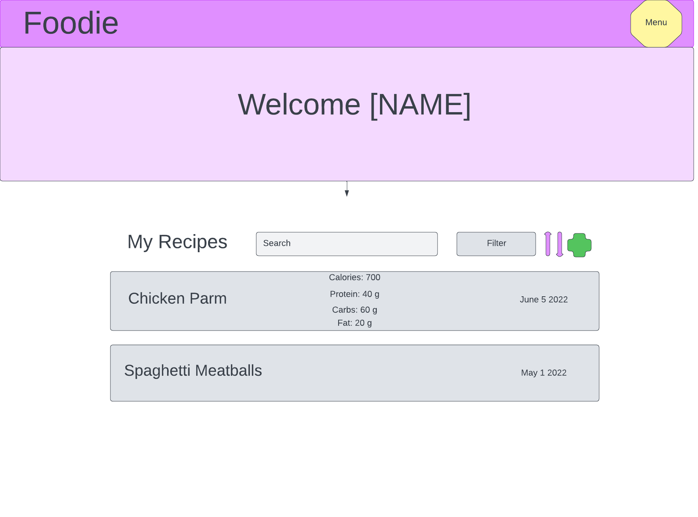

# Sprint 2
03-01-2023
## Members
**Front-End**: Dylan DePasquale and Richard Qian
**Back-End**: Pranav Venu and Paul Jablonowski

### Sprint 2 Branch:

## Links to Demos
- Link to Front-End Demo: https://www.youtube.com/watch?v=TSPHUCuxIeI
- Link to Back-End Demo: https://youtu.be/oZfnjbwGb5I

## User Stories

As a user of Foodie, I would like to create recipes and add their ingredients for my own reference.

Foodie should automatically visualize relevant nutritional information about a user-created recipe page to any user viewing it.

As a user of Foodie, I want to be able to create an account and login so that I can store my personal data/profile.

As a user of Foodie, I would like to save and organize recipes so that I can easily track the important nutritional information of my meals.

## Work Completed in Sprint 2

***Front-End***
* Landing Page
  * First page user sees when navigating to the website.
  * "Get started" button navigates user to the register page.

* Login / Register
  * Loading spinners allow users to know when processes are happening while frontend waits for backend response.
  * Error checking for blank input fields, valid email, and password  minimum length. Displays an error flag to warn users, not allowing them to submit in these cases.
  * Error flags for backend internal service errors. Frontend can handle backend error responses without interfering with the user experience.
  * Verifies inputted email and password are in a valid format
  * Routes to home page after receiving backend success response.
  
* Routing
  * Routing module containing all paths, showing titles on the site tab. Properly links components to all website route paths.
  * 404 page not found if user tries to enter a nonexistent route.
  
* Beginning Implementation of Auth Guard and JSON Web Tokens

* Favicon and 'Foodie' Logo
  * Designed a logo for our app

* Created wireframe for Home page
  

* Toolbar
  * Created two toolbars that will exist on the top of the web application
  * Login toolbar: toolbar for landing, login, and register page
    * Contains clickable logo that routes back to landing page and a log in button
  * App toolbar: a toolbar available for users who have logged in
    * Will contain more buttons and features than the login toolbar

* Refactoring
  * Previously had login and register pages in one component, now seperated into their own components to keep their functionality self contained and improve readability. Uses inheritance to adhere to DRY principle.
  

* Created Angular Unit Tests and E2E Cypress Tests

***Back-End***

 * main.go
	 * Added additional HTTP status codes and HTTP body fields to return to the frontend
	 * Added code to check for email usage in database in both login and register functions
	 * Started to implemement endpoint /recipeCreate that will be used to create a recipe entry in the database
 * api.go
	 * Started to implement code that will call the USDA food API and give us nutritional information about the requested food

 * Refactoring
    * Organized backend code originally in main() into functions to allow unit testing
   
 * Created unit tests 

## Unit Tests

***Front-End***

Landing Component ([landing.component.spec.ts](Angular%20Frontend/src/app/landing/landing.component.spec.ts))
* 'should navigate to login page'
  * Tests goToLogin() navigates to login page
* 'should navigate to register page'
  * Tests goToRegister() navigates to register page

Login Component ([login.component.spec.ts](Angular%20Frontend/src/app/login/login.component.spec.ts))
* 'should throw error message if email is missing'
  * Tests that an email must be submitted
* 'should throw error message if password is missing'
  * Tests that a password must be submitted
* 'should make a POST request to the server and navigate to home' 
  * Expects a POST request when user logs in, should receive a JWT (this test currently fails because JWT functionality is not completed)
* 'should set error message and clear form fields on error' 
  * should display error if log in fails, should also receive an error message from backend
* 'should navigate to register page'
  * Tests g=GoTo() routes to register page

Register Component ([register.component.spec.ts](Angular%20Frontend/src/app/register/register.component.spec.ts))
* should navigate to login page on click of "Already have an account?" button
  * Tests GoTo() function routes to login page
* should return true for a valid email
  * Tests email validation function isValidEmail() works properly
* should return false for an invalid email
  * Tests email validation function works properly

***Back-End***

TestHashPassword
 - This test checks that the password hashing function that is part of the bcrypt package works properly
 -  It hashes a test password and calls bcrypt's compare function to see if the hashed password matches the test password. If the compare function returns nil, then there are no errors and the test passes. Otherwise, the test throws an error message

TestRouterPOSTRegister
 - This test tries to register a user by sending a POST request to the /register endpoint
 - If the response is status code 200, then the user was successfully registered and the test passes. Otherwise, a status code of 500 is returned along with an error message
 - Note: This test will fail if you rerun the test without deleting the user it created in the database

TestRouterPOSTLogin
 - This test tries to login the user created in the TestRouterPOSTRegister test by sending a POST request to the /login endpoint
 - If the response is status code 200, then the user was successfully logged in and the test passes. Otherwise, a status code of 500 is returned along with an error message

TestRouterPOSTRecipeCreate
 - This test tries to create a recipe entry by sending a POST request to the /recipeCreate endpoint.
 - If the response is status code 200, then the recipe entry was successfuly created and the test passes. Otherwise a status code of 500 is returnd along with an error message
 - **This test should fail as we haven't finished implementing everything**

## Cypress Tests (Front-end)

During Sprint 2, we integrated the Cypress testing framework into our project and wrote some e2e tests that would simulate a user logging in. These tests need the frontend, backend, and database running in order to pass. We create two main test groups: 'Goes to Landing Page' and 'Test Log In Functionality'. The tests exist in [*Angular Frontend\cypress\e2e\spec.cy.ts*](Angular%20Frontend/cypress/e2e/spec.cy.ts).

In the landing page testing group, we verified that the main elements of the landing page and the toolbar existed. In addition, we tested that clicking the "LOG IN" button would route to the log in page. Likewise, we tested if clicking the "Start for Free" button would route to the register page. And then finally, we verified if clicking on our logo in the toolbar would route back to the landing page.

The 'Test Log In Functionality' test group simulates a user logging into Foodie. In our current implementation, if a login succeeds, the user is routed to a home page. There are two tests in this group: one attempting to log in with an invalid account and one logging in with an existing account. Cypress fills in necessary login forms with the corresponding account information and will verify if login succeeded or failed.

## Backend API Documentation

The Foodie Backend API currently contains four functions, a registration, login, user session, and a create recipe function.

### Register Function:

Description: This function takes user data inputted on the registration site and inputs it into a database full of users. This data can be pulled from in the future for other functions and allows for updates to the account to be made. When a successful user is created their corresponding id is returned along with a JSON web token. When failed, the function will return an error message related to the issue encountered.

Command call: /register

Method Type: POST

Information Requested:

	"FirstName": "John",

	"LastName": "Doe",

	"Email": "johndoe@example.com",

	"Password": "password"

#### Success Response:

StatusOK:

	“id”: <id number of user that was registered to database>

	“jwt”: <Current JSON Web Token >

Status Code: 200

#### Error Responses:

If the user data inputted cannot be parsed, the function will return an Internal Server Error:

	“Could not parse user data.”

If the user password inputted cannot be hashed, the function will return an Internal Server Error:

	“Could not securely hash password.”

If the function cannot create a connection with the database, the function will return an Internal Server Error:

	“Could not connect to database.”

If the user email inputted is already used, the function will return an Internal Server Error:

	“Email already in use.”

Status Code: 500

### Login Function:

Description: This function takes user data inputted on the login site and checks whether the user entry exists in the user database. Once checked for accuracy, the function will either respond with a success message or a variety of error messages. When a successful user is logged in their corresponding id is returned along with a JSON web token. When failed, the function will return an error message related to the issue encountered.

Command call: /login

Method Type: POST

Information Requested:

	"Email": "johndoe@example.com",

	"Password": "password"

#### Success Response:

StatusOK:

	“id”: <id number of user that was registered to database>

	“jwt”: <Current JSON Web Token >

Status Code: 200

#### Error Responses:

If the user data inputted cannot be parsed, the function will return an Internal Server Error:

	“Could not parse user data.”

If the database cannot be accessed, the function will return an Internal Server Error:

	"Couldn't connect to database."

If the email does not within the database, the function will return an Internal Server Error:

	"Email doesn't exist."

If the user inputted the wrong password, the function will return an Internal Server Error:

	"Incorrect password."

Status Code: 500

### User-session Function:

Description: The function checks if the JSON Web Token (JWT) received from the frontend matches the JWT in backend. This is used to make sure that the user is not accessing parts of the website they aren’t supposed to. When the JWTs match, a 200 code and a success message is returned. If they don't match, a 500 code and an error message is returned.

Command call: /user-session

Method Type: GET

Information Received: JSON Web Token

#### Success Response:

StatusOK: 

	“Success”

Status Code: 200

#### Error Response:

If the JSON Web Token (JWT) supplied from the frontend doesn’t match the expected JWT, the function will return an Internal Server Error:

	“jwt not authorized”

Status Code: 500

### Recipe Create Function:

Description: This function takes data inputted by the user about a recipe, including the name, description, ingredients, and the instructions. Eventually, this data will be able to be pulled to show the caloric and macro values associated with the recipe. When a successful recipe is created their corresponding recipe id. When failed, the function will return an error message related to the issue encountered.

Command call: /recipeCreate

Method Type: POST

Information Requested:

	"RecipeName": "Chicken Parmesan",

	"Description": "Pasta and Chicken",

	"Ingredients": "1.Chicken, 2. Pasta, 3. Parmesan Cheese",

	"Instructions": "1. Cook chicken and pasta separately 2. Add parmesan cheese to taste"

#### Success Response:

StatusOK:

	“id”: <id number of user that was registered to database>

	“jwt”: <Current JSON Web Token >

Status Code: 200

#### Error Responses:

If the user data inputted cannot be parsed, the function will return an Internal Server Error:

	“Could not parse recipe data.”

If the function cannot create a connection with the database, the function will return an Internal Server Error:

	“Could not connect to database.”

If the backend has an issue writing the recipe to the database, the function will return an Internal Server Error:

	"Could not create recipe."

If the user has already made the same recipe, the function will return an Internal Server Error:

	"Recipe already in use."

Status Code: 500
